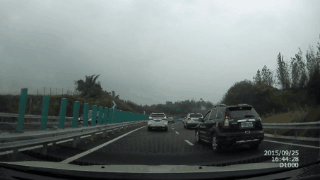

# $SalM^2$: Saliency Mamba Model
<a id="top"></a>
 - *For our proposed Sal method, we collect datasets and other popular modeling codes.*
 - *We give a series of instructions and demo files.*
 - *We promise to give the complete code and result files after the paper is accepted.*

## 🔥Update

- **2024/07/24**: All the code and models are completed.
  - our model ($SalM^2$)
    - How to train:  [command](#Run-train) & [script](#Run-train)
    - How to test:  [command](#Run-test ) & [script](#Run-test )
  - compare model
    - Static prediction model:  [command](#Run-train) & [script](#Run-train)
    - Dynamic prediction model:  [command](#Run-train) & [script](#Run-train)

## 💬Motivation


## ⚡Proposed Model

 

## 📖Datasets

| Name         | Train (video/frame)  | Valid (video/frame) | Test (video/frame)  | Dataset example                                              |
| ------------ | ------ | ----- | ----- | ------------------------------------------------------------ |
| TrafficGaze  | 49080  | 6655  | 19135 |  |
| DrFixD-rainy | 52291  | 9816  | 19154 |  |
| BDDA         | 286251 | 63036 | 93260 |  |

​	***For all datasets we will provide our download link with the official link. Please choose according to your needs**.

> (1) **TrafficGaze**: This dataset we uploaded in [link](www.baidu.com "Download Traffic_Gaze"). We crop 5 frames before and after each video. Official web in [link](https://github.com/taodeng/CDNN-traffic-saliency "Official Traffic_Gaze")。
>
> (2) **DrFixD-rainy**: This dataset we uploaded in [link](www.baidu.com "Download DrFixD-rainy"). We crop 5 frames before and after each video. Official web in [link](https://github.com/taodeng/DrFixD-rainy "Official DrFixD-rainy")。
>
> (3) **BDDA**: This dataset we uploaded in [link](www.baidu.com "Download BDDA"). Some camera videos and gazemap videos frame rate inconsistency, we have matched and cropped them. Some camera videos do not correspond to gazemap videos, we have filtered them. Official web in [link](https://deepdrive.berkeley.edu/ "Official BDDA")。

## 🛠️ Deployment **[🔁](#🔥Update)**<a name="top"></a>

------

### 	Run train 

​	👉*If you wish to train with our model, please use the proceeding steps below.*

1. Train our model.  You can use `--dataset name` to switch datasets, which include `Traffic_Gaze`, `DrFixD-rainy`, `BDDA`. Run the following command.

```python
python main.py --dataset 'BDDA'
```

​	2. Train compare model. If the model is a *<u>**static prediction method**</u>*，run the following command.

```python
python main.py --dataset 'Traffic_Gaze'
```

​	3. Train compare model. If the model is a ***<u>dynamic prediction method</u>***，run the following command.

```python
python main.py --dataset 'DrFixD-rainy'
```

### 	Run test 

​	👉*If you wish to make predictions directly using our model results, you can do so using the proceeding steps.*

​	1. Test our model.

​		(a) You need to download our trained model file in [link](www.baidu.com "Download salmm model.tar") and put it to the specified folder path.

​		(b) You should use `--dataset name` to switch datasets, which include `Traffic_Gaze`, `DrFixD-rainy`, `BDDA`. Run the following command.

```python
python test.py --dataset 'BDDA'
```

​	👉If you are unable to adapt your environment for other reasons, you can also download our predictions directly.

​	2. Download prediction results.

| $SalM^2$ for *TraffiGaze*                                    | $SalM^2$ for *DrFixD-rainy*                                  | $SalM^2$ for *BDDA*                                          |
| ------------------------------------------------------------ | ------------------------------------------------------------ | ------------------------------------------------------------ |
| [The prediction results link](www.baidu.com "Prediction TraffiGaze") | [The prediction results link](www.baidu.com "Prediction DrFixD-rainy") | [The prediction results link](www.baidu.com "Prediction BDDA") |


## 🚀 Live Demo **[🔁](#🔥Update)**

------



## ✨ Downstream Tasks

*Some interesting downstream tasks are shown here, and our work will be of significant research interest.*

- ***Saliency object detection***: saliency map → **Guide** → object detection

  

- ***Event recognition***: saliency map → **Guide** → event recognition

  

- ***Other downstream tasks***......

## ⭐️ Cite **[🔁](#🔥Update)**

If you find this repository useful, please use the following BibTeX entry for citation.

```python
wait accepted
```
