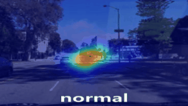
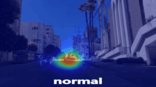
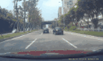
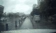
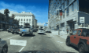
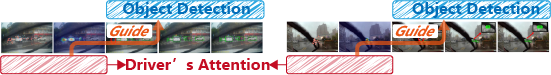
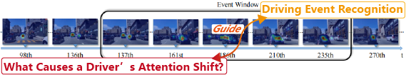

<div align="center">
  
  <br/>
<b>We collect datasets and other popular model codes.</b>
  <br/>
<b>We will give a series of instructions and demo files.</b>
  <br/>
<b>We promise to release all code after the paper is accepted.</b>
</div>


<div align="center">
  
  
  
</div>

## 🔥Update

- **2024/11/08**: ***update supplementary materials***. [Details](supplementary.md)

- - **We release all the runnable code. 🎉🎊**

- - **Comparison of Runtime and GPU memory.** 
  
    Better than the lightest network in the paper (Deng et al. 2019).
  
<div align="center">

</div>

- - **Driver attention shift cases. (+15 cases)**

<div align="center">

</div>

- - **Performance of different resolution for $SalM^2$. ($256^2$, $512^2$)**

<div align="center">
<table>
        <tr>
            <th>Dataset</th>
            <th>Image size</th>
            <th>AUC_B↑</th>
            <th>AUC_J↑</th>
            <th>NSS↑</th>
            <th>CC↑</th>
            <th>SIM↑</th>
            <th>KLD↓</th>
            <th>FLOPs↓</th>
        </tr>
        <tr>
            <td rowspan="2">TrafficGaze</td>
            <td>3×256×256</td>
            <td>0.92</td>
            <td>0.98</td>
            <td>5.90</td>
            <td>0.94</td>
            <td>0.78</td>
            <td>0.28</td>
            <td>4.45</td>
        </tr>
        <tr>
            <td>3×512×512</td>
            <td>0.92</td>
            <td>0.98</td>
            <td>6.04</td>
            <td>0.95</td>
            <td>0.80</td>
            <td>0.26</td>
            <td>4.72</td>
        </tr>
        <tr>
            <td rowspan="2">DrFixD-rainy</td>
            <td>3×256×256</td>
            <td>0.89</td>
            <td>0.95</td>
            <td>4.31</td>
            <td>0.86</td>
            <td>0.68</td>
            <td>0.47</td>
            <td>4.45</td>
        </tr>
        <tr>
            <td>3×512×512</td>
            <td>0.90</td>
            <td>0.96</td>
            <td>4.26</td>
            <td>0.86</td>
            <td>0.69</td>
            <td>0.45</td>
            <td>4.72</td>
        </tr>
</table>
</div>


- **2024/10/23**: We release the uniform saliency dataset loader. You can simply use it by `from utils.datasets import build_dataset`.

- **2024/07/24**: All the code and models are completed.

- - our model ($SalM^2$)
    - How to train:  [command](#Run-train ) & [script](#Run-train )
    - How to test:  [command](#Run-test ) & [script](#Run-test )
  - compare model
    - Static prediction model:  [command](#Run-train ) & [script](#Run-train )
    - Dynamic prediction model:  [command](#Run-train ) & [script](#Run-train )
  
- **2024/07/05**: We collect the possible datasets to use, and make a uniform dataloader.

- **2024/06/14**: 🤩Our model is proposed !

## 💬Motivation

​	**(1) Using semantic information to guide driver attention.**
<div align="center">

</div>
<b>Solution:</b> We propose a dual-branch network that separately extracts semantic information and image information. The semantic information is used to guide the image information at the deepest level of image feature extraction.

​	**(2) Reducing model parameters and computational complexity.**
<div align="center">

</div>
<b>Solution:</b> We develop a highly lightweight saliency prediction network based on the latest Mamba framework, with only <b>0.0785M</b> (<b>88% reduction compared to SOTA</b>) parameters and <b>4.45G FLOPs</b> (<b>37% reduction compared to SOTA</b>).

## ⚡Proposed Model

we propose a saliency mamba model, named $SalM^2$ that uses "Top-down" driving scene semantic information to guide "Bottom-up" driving scene image information to simulate human drivers' attention allocation. 


## 📖Datasets
<div align="center">
<table>
  <thead>
    <tr>
      <th>Name</th>
      <th>Train (video/frame)</th>
      <th>Valid (video/frame)</th>
      <th>Test (video/frame)</th>
      <th>Dataset example</th>
    </tr>
  </thead>
  <tbody>
    <tr>
      <td>TrafficGaze</td>
      <td>49080</td>
      <td>6655</td>
      <td>19135</td>
      <td></td>
    </tr>
    <tr>
      <td>DrFixD-rainy</td>
      <td>52291</td>
      <td>9816</td>
      <td>19154</td>
      <td></td>
    </tr>
    <tr>
      <td>BDDA</td>
      <td>286251</td>
      <td>63036</td>
      <td>93260</td>
      <td></td>
    </tr>
  </tbody>
</table>
</div>
【note】 For all datasets we will provide our download link with the official link. Please choose according to your needs.

> (1) **TrafficGaze**: This dataset we uploaded in [link](www.baidu.com "Download TrafficGaze"). We crop 5 frames before and after each video. Official web in [link](https://github.com/taodeng/CDNN-traffic-saliency "Official Traffic_Gaze").
>
> (2) **DrFixD-rainy**: This dataset we uploaded in [link](www.baidu.com "Download DrFixD-rainy"). We crop 5 frames before and after each video. Official web in [link](https://github.com/taodeng/DrFixD-rainy "Official DrFixD-rainy").
>
> (3) **BDDA**: This dataset we uploaded in [link](www.baidu.com "Download BDDA"). Some camera videos and gazemap videos frame rate inconsistency, we have matched and cropped them. Some camera videos do not correspond to gazemap videos, we have filtered them. Official web in [link](https://deepdrive.berkeley.edu/ "Official BDDA").

<div align="center">
<table style="width: 100%; table-layout: auto;">
  <tr>
    <th>TrafficGaze</th>
    <th>DrFixD-rainy</th>
    <th>BDDA</th>
  </tr>
  <tr>
    <td>
      ./TrafficGaze<br>
      &emsp;&emsp;|——fixdata<br>
      &emsp;&emsp;|&emsp;&emsp;|——fixdata1.mat<br>
      &emsp;&emsp;|&emsp;&emsp;|——fixdata2.mat<br>
      &emsp;&emsp;|&emsp;&emsp;|—— ... ...<br>
      &emsp;&emsp;|&emsp;&emsp;|——fixdata16.mat<br>
      &emsp;&emsp;|——trafficframe<br>
      &emsp;&emsp;|&emsp;&emsp;|——01<br>
      &emsp;&emsp;|&emsp;&emsp;|&emsp;&emsp;|——000001.jpg<br>
      &emsp;&emsp;|&emsp;&emsp;|&emsp;&emsp;|—— ... ...<br>
      &emsp;&emsp;|&emsp;&emsp;|——02<br>
      &emsp;&emsp;|&emsp;&emsp;|—— ... ...<br>
      &emsp;&emsp;|&emsp;&emsp;|——16<br>
      &emsp;&emsp;|——test.json<br>
      &emsp;&emsp;|——train.json<br>
      &emsp;&emsp;|——valid.json
    </td>
    <td>
      ./DrFixD-rainy<br>
      &emsp;&emsp;|——fixdata<br>
      &emsp;&emsp;|&emsp;&emsp;|——fixdata1.mat<br>
      &emsp;&emsp;|&emsp;&emsp;|——fixdata2.mat<br>
      &emsp;&emsp;|&emsp;&emsp;|—— ... ...<br>
      &emsp;&emsp;|&emsp;&emsp;|——fixdata16.mat<br>
      &emsp;&emsp;|——trafficframe<br>
      &emsp;&emsp;|&emsp;&emsp;|——01<br>
      &emsp;&emsp;|&emsp;&emsp;|&emsp;&emsp;|——000001.jpg<br>
      &emsp;&emsp;|&emsp;&emsp;|&emsp;&emsp;|—— ... ...<br>
      &emsp;&emsp;|&emsp;&emsp;|——02<br>
      &emsp;&emsp;|&emsp;&emsp;|—— ... ...<br>
      &emsp;&emsp;|&emsp;&emsp;|——16<br>
      &emsp;&emsp;|——test.json<br>
      &emsp;&emsp;|——train.json<br>
      &emsp;&emsp;|——valid.json
    </td>
    <td>
      ./BDDA<br>
      &emsp;&emsp;|——camera_frames<br>
      &emsp;&emsp;|&emsp;&emsp;|——0001<br>
      &emsp;&emsp;|&emsp;&emsp;|&emsp;&emsp;|——0001.jpg<br>
      &emsp;&emsp;|&emsp;&emsp;|&emsp;&emsp;|—— ... ...<br>
      &emsp;&emsp;|&emsp;&emsp;|——0002<br>
      &emsp;&emsp;|&emsp;&emsp;|—— ... ...<br>
      &emsp;&emsp;|&emsp;&emsp;|——2017<br>
      &emsp;&emsp;|——gazemap_frames<br>
      &emsp;&emsp;|&emsp;&emsp;|——0001<br>
      &emsp;&emsp;|&emsp;&emsp;|&emsp;&emsp;|——0001.jpg<br>
      &emsp;&emsp;|&emsp;&emsp;|&emsp;&emsp;|—— ... ...<br>
      &emsp;&emsp;|&emsp;&emsp;|——0002<br>
      &emsp;&emsp;|&emsp;&emsp;|—— ... ...<br>
      &emsp;&emsp;|&emsp;&emsp;|——2017<br>
      &emsp;&emsp;|——test.json<br>
      &emsp;&emsp;|——train.json<br>
      &emsp;&emsp;|——valid.json
    </td>
  </tr>
</table>
</div>

## 🛠️ Deployment **[🔁](#🔥Update)**

### 	Run train 

​	👉*If you wish to train with our model, please use the proceeding steps below.*

1. Train our model.  You can use `--category` to switch datasets, which include `TrafficGaze`, `DrFixD-rainy`, `BDDA`. `--b` sets batch size, `--g` sets id of cuda.

```python
python train.py --network salmm --b 32 --g 0 --category xxx --root xxx
```

​	2. Train compare model. If the model is a *<u>**static prediction method**</u>*, run the following command.

```python
python train.py --network xxx --b 32 --g 1 --category xxx --root xxx
```

​	3. Train compare model. If the model is a ***<u>dynamic prediction method</u>***, set `--seq_len` and run the following command.

```python
python train.py --network xxx --b 32 --seq_len 6 --g 2 --category xxx --root xxx
```

### 	Run test 

​	👉*If you wish to make predictions directly using our model results, you can do so using the proceeding steps.*

​	1. Test our model.

​		(a) You need to download our trained model file in [link](www.baidu.com "Download salmm model.tar") and put it to the specified folder path.

​		(b) You should use `--category` to switch datasets, which include `TrafficGaze`, `DrFixD-rainy`, `BDDA`. Run the following command.

```python
python evaluate-metrics.py --network salmm --b 1 --g 0 --category xxx --root xxx --test_weight xxx
```

​	👉If you are unable to adapt your environment for other reasons, you can also download our predictions directly.

​	2. Download prediction results.

<div align="center">
<table>
  <thead>
    <tr>
      <th><i>$SalM^2$</i> for <i>TrafficGaze</i></th>
      <th><i>$SalM^2$</i> for <i>DrFixD-rainy</i></th>
      <th><i>$SalM^2$</i> for <i>BDDA</i></th>
    </tr>
  </thead>
  <tbody>
    <tr>
      <td><a href="http://www.baidu.com" title="Prediction TrafficGaze">The prediction results link</a></td>
      <td><a href="http://www.baidu.com" title="Prediction DrFixD-rainy">The prediction results link</a></td>
      <td><a href="http://www.baidu.com" title="Prediction BDDA">The prediction results link</a></td>
    </tr>
  </tbody>
</table>
</div>

## 🚀 Live Demo **[🔁](#🔥Update)**

<div align="center">
  
  
  
</div>


## ✨ Downstream Tasks

*Some interesting downstream tasks are shown here, and our work will be of significant research interest.*

- ***Saliency object detection***: `saliency map` → **Guide** → `object detection`
<div align="center">
  
</div>

- ***Event recognition***: `saliency map` → **Guide** → `event recognition`

<div align="center">
  
</div>

- ***Other downstream tasks***......

## ⭐️ Cite **[🔁](#🔥Update)**

If you find this repository useful, please use the following BibTeX entry for citation.

```python
wait accepted
```
