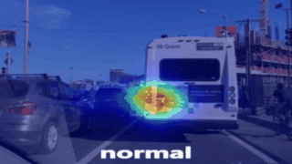
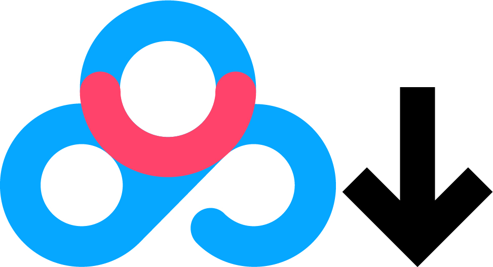

<div align="center">
<a name="start-anchor"></a>
</div>
<div align="center">
  
</div>

<div align="center">
<b>Authors: 
<a href="https://scholar.google.com.hk/citations?user=IOeG3ygAAAAJ&hl=zh-CN" target="_blank">Chunyu Zhao</a>, 
Wentao Mu, 
Xian Zhou, 
<a href="https://scholar.google.com.hk/citations?user=evBOeoAAAAAJ&hl=zh-CN" target="_blank">Wenbo Liu</a>, 
Fei Yan, 
<a href="https://scholar.google.com.hk/citations?user=WQ2hfUYAAAAJ&hl=zh-CN" target="_blank">Tao Deng</a><sup>📧</sup>
</b>
</div>
<p align="center">

[](https://arxiv.org/pdf/2502.16214)
[](https://ojs.aaai.org/index.php/AAAI/article/view/32157)
[](./LICENSE)

</p>


<div align="center">
<b>Contact: springyu.zhao@foxmail.com&nbsp;&nbsp;&nbsp;&nbsp;&nbsp;&nbsp;📧: corresponding author</b>
</div>
<div align="center">
  
  
  
</div>


## 🔥Update

- **2025/03/03**: ***Complete the contents of the code repository***.
	- Datasets upload: `Trafficgaze`✅, `DrFixD-rainy`✅, `BDDA`✅
	- Environment configuration: [`environment`](#Environment)✅
	- Visualization code: our code in repository. [`visualization`](#Run-visualization)✅
	- Evaluation metrics code: our code in repository. `python`✅, [`Matlab (official)`](metrics/README.md)✅
	
- **2024/12/10**: ***Our paper is accepted by AAAI🎉🎉🎉***. <a href="https://arxiv.org/pdf/2502.16214" ></a>

- **2024/11/08**: ***Update supplementary materials***. [Details](supplementary.md)

- **2024/10/23**: We release the uniform saliency dataset loader. You can simply use it by `from utils.datasets import build_dataset`.

- **2024/07/25**: How to use our model (**SalM²**).
    - How to train:  [command](#Run-train ) & [script](deployment.md)
    - How to test:  [command](#Run-test ) & [script](deployment.md)
  - compare model
    - Static prediction model:  [command](#Run-train ) & [script](deployment.md)
    - Dynamic prediction model:  [command](#Run-train ) & [script](deployment.md)

- **2024/07/24**: All the code and models are completed.

- **2024/07/05**: We collect the possible datasets to use, and make a uniform dataloader.

- **2024/06/14**: Our model is proposed !

## 💬Motivation [🔁](#start-anchor)

​	**(1) Using semantic information to guide driver attention.**
<div align="center">

</div>
<b>Solution:</b> We propose a dual-branch network that separately extracts semantic information and image information. The semantic information is used to guide the image information at the deepest level of image feature extraction.

​	**(2) Reducing model parameters and computational complexity.**
<div align="center">

</div>
<b>Solution:</b> We develop a highly lightweight saliency prediction network based on the latest Mamba framework, with only <b>0.0785M</b> (<b>88% reduction compared to SOTA</b>) parameters and <b>4.45G FLOPs</b> (<b>37% reduction compared to SOTA</b>).

## ⚡Proposed Model [🔁](#start-anchor)

we propose a saliency mamba model, named **SalM²** that uses "Top-down" driving scene semantic information to guide "Bottom-up" driving scene image information to simulate human drivers' attention allocation. 


## 📖Datasets [🔁](#start-anchor)
<div align="center">
<table>
  <thead>
    <tr>
      <th>Name</th>
      <th>Train (video/frame)</th>
      <th>Valid (video/frame)</th>
      <th>Test (video/frame)</th>
      <th>Dataset example</th>
    </tr>
  </thead>
  <tbody>
    <tr>
      <td>TrafficGaze</td>
      <td>49080</td>
      <td>6655</td>
      <td>19135</td>
      <td></td>
    </tr>
    <tr>
      <td>DrFixD-rainy</td>
      <td>52291</td>
      <td>9816</td>
      <td>19154</td>
      <td></td>
    </tr>
    <tr>
      <td>BDDA</td>
      <td>286251</td>
      <td>63036</td>
      <td>93260</td>
      <td></td>
    </tr>
  </tbody>
</table>
</div>
【note】 For all datasets we will provide our download link with the official link. Please choose according to your needs.

> (1) **TrafficGaze**: This dataset we uploaded in BaiduYun (code: SALM) [<a href="https://pan.baidu.com/s/1MJaNCcVe7vLSbcDSG0A3-w?pwd=SALM" ></a>](www.baidu.com "Download TrafficGaze"). We crop 5 frames before and after each video. Official web in [link](https://github.com/taodeng/CDNN-traffic-saliency "Official Traffic_Gaze").
>
> (2) **DrFixD-rainy**: This dataset we uploaded in BaiduYun (code: SALM) [<a href="https://pan.baidu.com/s/1wYqS7ZrkKbxfOHZlczvSUA?pwd=SALM" ></a>](www.baidu.com "Download DrFixD-rainy"). We crop 5 frames before and after each video. Official web in [link](https://github.com/taodeng/DrFixD-rainy "Official DrFixD-rainy").
>
> (3) **BDDA**: This dataset we uploaded in BaiduYun (code: BDDA) [<a href="https://pan.baidu.com/s/1JDUejLifqF3vFOx-3izYdw?pwd=BDDA" ></a>](www.baidu.com "Download BDDA"). Some camera videos and gazemap videos frame rate inconsistency, we have matched and cropped them. Some camera videos do not correspond to gazemap videos, we have filtered them. Official web in [link](https://deepdrive.berkeley.edu/ "Official BDDA").

<div align="center">
<table style="width: 100%; table-layout: auto;">
  <tr>
    <th>TrafficGaze</th>
    <th>DrFixD-rainy</th>
    <th>BDDA</th>
  </tr>
  <tr>
    <td>
      ./TrafficGaze<br>
      &emsp;&emsp;|——fixdata<br>
      &emsp;&emsp;|&emsp;&emsp;|——fixdata1.mat<br>
      &emsp;&emsp;|&emsp;&emsp;|——fixdata2.mat<br>
      &emsp;&emsp;|&emsp;&emsp;|—— ... ...<br>
      &emsp;&emsp;|&emsp;&emsp;|——fixdata16.mat<br>
      &emsp;&emsp;|——trafficframe<br>
      &emsp;&emsp;|&emsp;&emsp;|——01<br>
      &emsp;&emsp;|&emsp;&emsp;|&emsp;&emsp;|——000001.jpg<br>
      &emsp;&emsp;|&emsp;&emsp;|&emsp;&emsp;|—— ... ...<br>
      &emsp;&emsp;|&emsp;&emsp;|——02<br>
      &emsp;&emsp;|&emsp;&emsp;|—— ... ...<br>
      &emsp;&emsp;|&emsp;&emsp;|——16<br>
      &emsp;&emsp;|——test.json<br>
      &emsp;&emsp;|——train.json<br>
      &emsp;&emsp;|——valid.json
    </td>
    <td>
      ./DrFixD-rainy<br>
      &emsp;&emsp;|——fixdata<br>
      &emsp;&emsp;|&emsp;&emsp;|——fixdata1.mat<br>
      &emsp;&emsp;|&emsp;&emsp;|——fixdata2.mat<br>
      &emsp;&emsp;|&emsp;&emsp;|—— ... ...<br>
      &emsp;&emsp;|&emsp;&emsp;|——fixdata16.mat<br>
      &emsp;&emsp;|——trafficframe<br>
      &emsp;&emsp;|&emsp;&emsp;|——01<br>
      &emsp;&emsp;|&emsp;&emsp;|&emsp;&emsp;|——000001.jpg<br>
      &emsp;&emsp;|&emsp;&emsp;|&emsp;&emsp;|—— ... ...<br>
      &emsp;&emsp;|&emsp;&emsp;|——02<br>
      &emsp;&emsp;|&emsp;&emsp;|—— ... ...<br>
      &emsp;&emsp;|&emsp;&emsp;|——16<br>
      &emsp;&emsp;|——test.json<br>
      &emsp;&emsp;|——train.json<br>
      &emsp;&emsp;|——valid.json
    </td>
    <td>
      ./BDDA<br>
      &emsp;&emsp;|——camera_frames<br>
      &emsp;&emsp;|&emsp;&emsp;|——0001<br>
      &emsp;&emsp;|&emsp;&emsp;|&emsp;&emsp;|——0001.jpg<br>
      &emsp;&emsp;|&emsp;&emsp;|&emsp;&emsp;|—— ... ...<br>
      &emsp;&emsp;|&emsp;&emsp;|——0002<br>
      &emsp;&emsp;|&emsp;&emsp;|—— ... ...<br>
      &emsp;&emsp;|&emsp;&emsp;|——2017<br>
      &emsp;&emsp;|——gazemap_frames<br>
      &emsp;&emsp;|&emsp;&emsp;|——0001<br>
      &emsp;&emsp;|&emsp;&emsp;|&emsp;&emsp;|——0001.jpg<br>
      &emsp;&emsp;|&emsp;&emsp;|&emsp;&emsp;|—— ... ...<br>
      &emsp;&emsp;|&emsp;&emsp;|——0002<br>
      &emsp;&emsp;|&emsp;&emsp;|—— ... ...<br>
      &emsp;&emsp;|&emsp;&emsp;|——2017<br>
      &emsp;&emsp;|——test.json<br>
      &emsp;&emsp;|——train.json<br>
      &emsp;&emsp;|——valid.json
    </td>
  </tr>
</table>
</div>

## 🛠️ Deployment [🔁](#start-anchor)

### 	Environment

​	👉*If you have downloaded our `repository code` and installed `PyTorch` and `CUDA`.*  [More details](deployment.md#(1)-Environment)

```python
pip install -r requirements.txt
pip install -e utils/models/causal-conv1d
pip install -e utils/models/mamba
```

### 	Run train 

​	👉*If you wish to train with our model, please use the command below.* [More details](deployment.md)

```python
python train.py --network salmm --b 32 --g 0 --category xxx --root xxx
```

### 	Run test 

#### 		[1] Official test [⭐⭐⭐]

We calculate the predicted values and then use `Matlab` for the prediction. [More details](metrics/README.md)

```python
cd metrics
./run_matlab.sh
```

#### 		[2] General test

Although `Python` testing is more convenient, our test benchmark is based on the previous work (`CDNN`、`DrFixD-rainy`、......), and the results calculated by `Python` do not match those calculated by `Matlab`. We have provided a `Python` test code, which is basically consistent with `Matlab` in terms of `CC`, `SIM`, and `KLD` metrics.

​	👉*If you wish to start with a rough evaluation metric, you can do so using the command.*  [More details](deployment.md#(3)-Run-Test)

```python
python evaluate_metrics.py --network salmm --b 1 --g 0 --category xxx --root xxx --test_weight xxx
```

### 	Run visualization

We also offer visualized code. Visualization can support the input of various types of data such as `str`, `list`, and `dataloader`. [More details](deployment.md#(4)-Run-visualization)

​	👉*If you want to visualize all the data of a certain dataset directly, you can use the following command.*

```python
python visualization.py --network salmm --b 1 --g 0 --category xxx --root xxx --test_weight xxx
```

## 🚀 Live Demo [🔁](#start-anchor)

<div align="center">
  
  
  
</div>


## ✨ Downstream Tasks [🔁](#start-anchor)

*Some interesting downstream tasks are shown here, and our work will be of significant research interest.*

- ***Saliency object detection***: `saliency map` → **Guide** → `object detection`
<div align="center">
  
</div>

- ***Event recognition***: `saliency map` → **Guide** → `event recognition`

<div align="center">
  
</div>

- ***Other downstream tasks***......


## 🙌 Acknowledgements [🔁](#start-anchor)

Thank you to all collaborators for your support and to those who have helped improve this repository.

<table>
  <tr>
    <td align="center">
      <a href="https://github.com/zhao-chunyu">
        
      </a>
      <br>Core Author
    </td>
    <td align="center">
      <a href="https://github.com/MoonTao1">
        
      </a>
      <br>Core Author
    </td>
    <td align="center">
      <a href="https://github.com/liu-5658">
        
      </a>
      <br>Core Author
    </td>
    <td align="center">
      <a href="https://github.com/taodeng">
        
      </a>
      <br>Core Author
    </td>
    <td align="center">
      <a href="https://github.com/ly27253">
        
      </a>
      <a href="https://github.com/zhao-chunyu/SaliencyMamba/issues/3">
      <br>Repository
      </a>
    </td>
    <td align="center">
      <a href="https://github.com/ybLin-TJ">
        
      </a>
      <a href="https://github.com/zhao-chunyu/SaliencyMamba/issues/4">
      <br>Repository
      </a>
  </tr>
</table>

> Repository: It indicates that reproducing the repository helps to improve the repository errors.

## ⭐️ Cite [🔁](#start-anchor)


If you find this repository useful, please use the following BibTeX entry for citation  and give us a star⭐.

```python
@article{zhao2025salmamba, 
  title={SalM²: An Extremely Lightweight Saliency Mamba Model for Real-Time Cognitive Awareness of Driver Attention}, 
  volume={39}, 
  DOI={10.1609/aaai.v39i2.32157},  
  number={2},
  journal={Proceedings of the AAAI Conference on Artificial Intelligence}, 
  author={Zhao, Chunyu and Mu, Wentao and Zhou, Xian and Liu, Wenbo and Yan, Fei and Deng, Tao}, 
  year={2025}, 
  month={Apr.}, 
  pages={1647-1655} 
}
```
