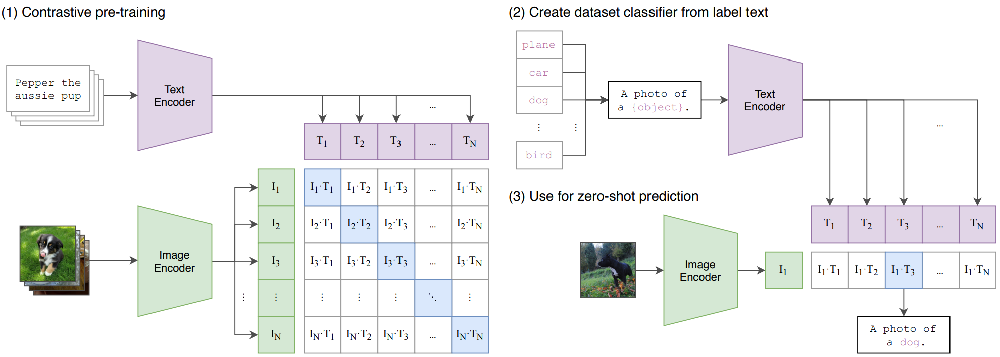
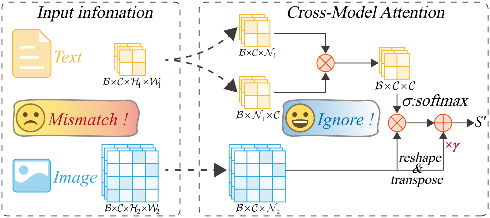
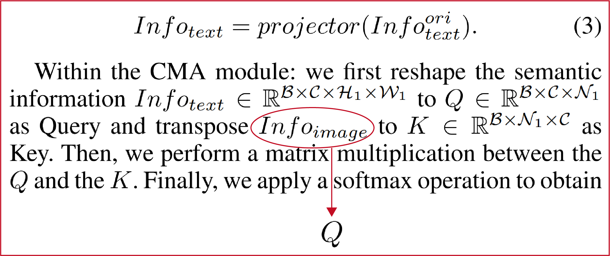

# Issue: Cross-Modal Attention Mechanism

在此我将进行统一的回复Cross-Modal Attention Mechanism中Q、K、V的疑惑。


## #1 本文的Motivation

我们的Motivation之一是希望采用场景中的语义信息去引导驾驶员关注“自顶向下”的信息（即由驾驶任务驱动的信息，比如过马路的行人、红绿灯等），所以核心之一是需要获取相应的语义信息。

## #2 语义信息的获取方式

- 对于TrafficGaze [[1]](#ref_TrafficGaze)、DrFixD-Rainy [[2]](#ref_DrFixD-Rainy)、BDDA [[3]](#ref_BDDA) 数据集来说，都是包含驾驶场景和驾驶员注意信息，不涵盖语义信息，那么如何获取相应的语义信息呢？

- 我们采用一个简单的方式以解决这个问题，采用CLIP [[4]](#ref_clip) 获取该图像的语义信息，在这里我们采用CLIP的图像编码器作为语义信息提取器，那为什么采用图像编码器用于提取语义信息呢？感觉很矛盾。

- 如图1所示，我们认为CLIP作为一个<Image, Text>图像文本对训练得到的大模型，其ImageEncoder和TextEncoder在经过训练之后，其得到的Token_I和Token_T已经被拉进到相似的特征语义空间可以作为语义信息直接使用。此外场景图像没有直接语义信息，因此本文采用CLIP的ImageEncoder用于提取相应的语义信息。

<div style="text-align: center;">
  
  <p style="margin-top: 8px;">
    <a href="#ref_clip" style="text-decoration: none; color: #555;">
      图 1：CLIP方法对比训练流程图[4]
    </a>
  </p>
</div>

## #3 CMA模块的设计

- 尽管得到语义信息通过简单的使用CLIP获取，但是如何将语义信息融合图像特征，实现良好的引导效果，得到更好的预测结果仍然是一个问题。更加不幸的是，语义信息的尺寸和图像特征的尺寸存在差异，不能直接相加。无论采用上采样/下采样，都会造成信息丢失，因此我们采用通道注意力的思想进行融合，以此可以规避尺寸不同的问题。那么Q、K、V的选取如何选择的呢？

- 由于在预测过程中始终以图像信息为主，而语义信息是引导信息（辅助信息），因此我们的主信息仍然是图像信息V，语义信息作为Q和K。


### #4 易混淆的点解释

**代码**：在论文中我们的CMA模块的代码书写如下，我们对其简单的加了注释，其中的代码与原图是相互对应的无误。[完整代码](https://github.com/zhao-chunyu/SaliencyMamba/blob/main/utils/models/SalMM.py "Detail CMA")

```
'''
CrossModelAtt: q-->clip  k-->clip  v-->feature
'''
class CrossModelAtt(nn.Module):
    def __init__(self, backbone=backbone[id], device=device):
        super().__init__()
        self.device = device
        self.model, _ = clip.load(backbone)
        self.model = self.model.eval()

        self.gamma = nn.Parameter(torch.zeros(1))
        self.softmax = nn.Softmax(dim=-1)

'''
传入参数解释：
	img:驾驶场景图像，通过clip提取得到语义信息q,k
    	q的获取代码：q = clip_feature.view(b, c, -1)
    	k的获取代码：k = clip_feature.view(b, c, -1).permute(0, 2, 1)
	feature:主干网络提取的图像特征，作为v
		v的获取代码：v = feature.view(b, c, -1)]
'''
    def forward(self, img, feature):
        # 1: get clip feature
        b, c, h, w = feature.shape
		...... # 省略，见源代码
        return perception_info

```

**论文**：我们的CMA模块的图如图2所示，与上述代码一致无误。

<div style="text-align: center;">
  
  <p style="margin-top: 8px;">
    <a href="#ref_salmm" style="text-decoration: none; color: #555;">
      图 2：SalM²方法中CMA模块[5]
    </a>
  </p>
</div>
> **⭐值得说明的是**:

> - 图2中的Text实际想表达的意思是语义信息，写成Semantic可能更易于理解。
> - 在原文中的公式3后面的那段中有笔误如图3，由于已经发表，我们在此处说明。

<div style="text-align: center;">
  
  <p style="margin-top: 8px;">
    <a href="#ref_salmm" style="text-decoration: none; color: #555;">
      图 3：SalM²书写错误修订[5]
    </a>
  </p>
</div>

## Reference

<div align="left">
<a name="ref_TrafficGaze"></a>
[1] T. Deng, H. Yan, L. Qin, T. Ngo and B. S. Manjunath, "How Do Drivers Allocate Their Potential Attention? Driving Fixation Prediction via Convolutional Neural Networks," IEEE Transactions on Intelligent Transportation Systems. 2020.
</div>

<div align="left">
<a name="ref_DrFixD-Rainy"></a>
[2] H. Tian, T. Deng and H. Yan, "Driving as well as on a Sunny Day? Predicting Driver's Fixation in Rainy Weather Conditions via a Dual-Branch Visual Model," IEEE/CAA Journal of Automatica Sinica. 2022.
</div>

<div align="left">
<a name="ref_BDDA"></a>
[3] Xia, Ye, et al. "Predicting driver attention in critical situations." Computer vision–ACCV 2018: 14th Asian conference on computer vision. 2019.
</div>

<div align="left">
<a name="ref_clip"></a>
[4] Radford, Alec, et al. "Learning transferable visual models from natural language supervision." Proceedings of the 38th International Conference on Machine Learning. 2021.
</div>

<div align="left">
<a name="ref_salmm"></a>
[5] Zhao, Chunyu, et al. "SalM²: An Extremely Lightweight Saliency Mamba Model for Real-Time Cognitive Awareness of Driver Attention." Proceedings of the AAAI Conference on Artificial Intelligence. 2025.
</div>